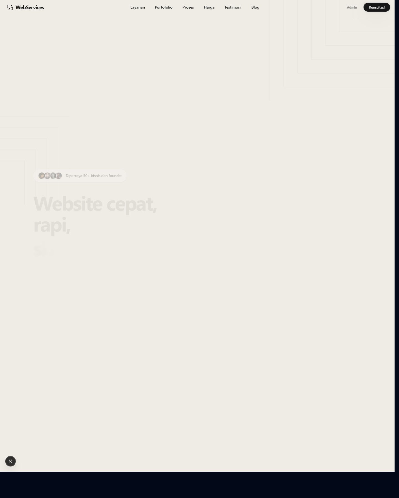
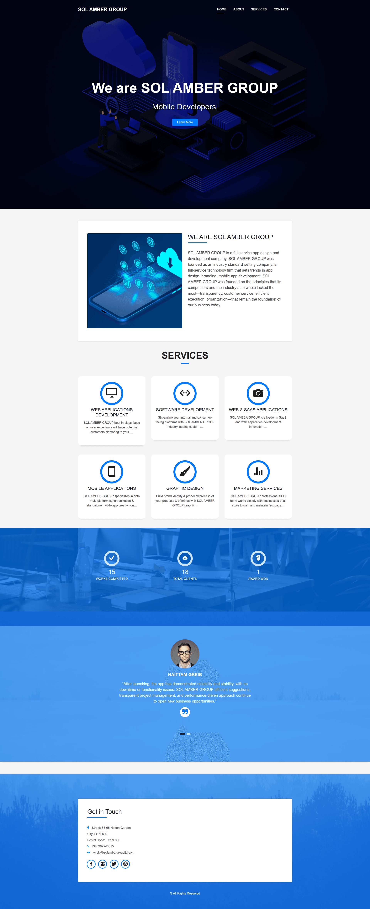
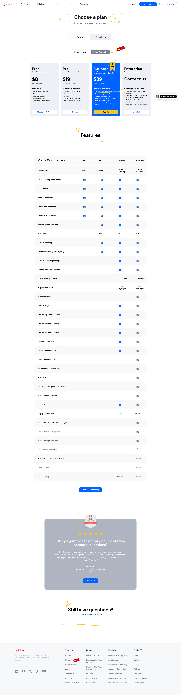
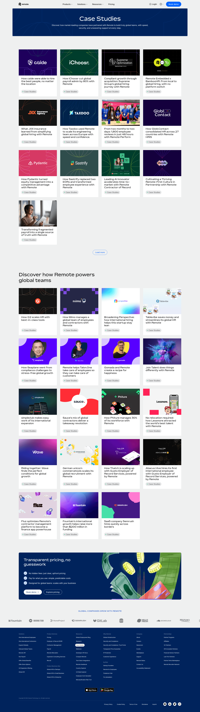

# Design Improvement: BuildWebsite Homepage

## TL;DR
Homepage sebelumnya rapi, tetapi terlalu banyak ruang kosong di hero, section sekunder terasa sama besar, navbar terlalu padat, dan beberapa bagian memakai copy/visual yang terasa placeholder. Implementasi sekarang memprioritaskan offer UMKM, ritme section yang lebih jelas, nav auth yang lebih natural, portfolio lebih kredibel, dan satu aksen brand emerald.

## Current State

*Homepage sebelum revisi: hero terlihat terlalu turun pada viewport tinggi, nav memuat Admin publik, dan headline belum langsung menjawab target, outcome, dan timeline.*

## Improvement Ideas Implemented

### 1. Make the hero answer who, outcome, and timeline
Changed the hero from a broad "website cepat, rapi" promise to a sharper UMKM offer with lead and launch-time framing.

Inspired by:

*Solamber - agency landing page with clear service positioning, simple navigation, service grid, stats, and contact panel. [Lazyweb]*

Why this works: service websites need to establish relevance in the first viewport. The new hero says the audience, outcome, and operating promise faster.

Sketch:
```text
[Badge: UMKM leads]
Website profesional untuk UMKM
[siap dapat leads / launch 7-21 hari / mudah dikelola]
Short proof copy
[Konsultasi Gratis] [Lihat Portfolio]
[7-21 hari] [98 score] [CMS]
```

### 2. Reduce decision load in pricing
Pricing now keeps three tiers, highlights one recommended tier, uses Indonesian copy, and makes the middle plan feel like the guided option.

Inspired by:

*Guidde - three-tier pricing cards with benefits, pricing, and clear plan selection. [Lazyweb]*

Why this works: pricing references consistently make comparison easy through three/four cards, a highlighted recommended plan, clear CTAs, and short feature lists.

Sketch:
```text
Starter        Profesional        Enterprise
Rp 5 juta      Rp 15 juta         Kustom
basic leads    CMS + SEO          app/API scope
[CTA]          [Terpopuler CTA]   [CTA]
```

### 3. Make portfolio feel like case-study evidence
Portfolio images are now distinct by use case instead of repeating the same image, and the labels explain business outcomes.

Inspired by:

*Remote - case-study grid with client/project thumbnails and a featured discovery section. [Lazyweb]*

Why this works: for an agency/service site, portfolio is the strongest trust surface. Distinct visual examples make the section feel more credible and less templated.

Sketch:
```text
Company Profile   Dashboard   Katalog UMKM   Campaign
[visual]          [visual]    [visual]       [visual]
outcome copy      tags        outcome copy   tags
```

## What's Working
- The neutral visual direction is already clean and fits a service/agency site.
- The interactive hero mockup gives the page a custom product feel.
- Pricing already had a clear three-tier structure, which is a good base.
- The page has the right conversion sections: hero, services, workflow, portfolio, pricing, proof, CTA, FAQ.

## All References
- Solamber agency homepage - `references/lazyweb-solamber-agency-homepage.png`
- Guidde pricing cards - `references/lazyweb-guidde-pricing-cards.png`
- Remote case studies - `references/lazyweb-remote-case-studies.png`
